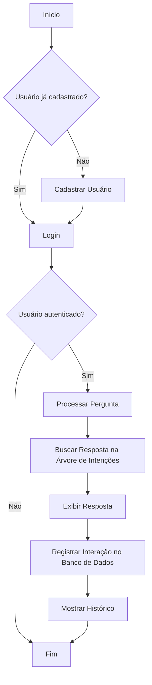
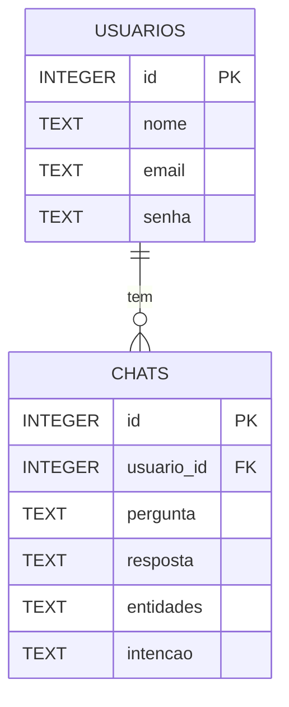

# Chatbot de Aluguel de Veículos
    Projeto entregue como trabalho da disciplina eletiva de Chatbot do curso de Análise e Desenvolvimento de Sistema do Senai Gaspar Ricardo Júnior - Sorocaba/SP
    data: 02/12/2024

## Como Funciona o Projeto

Este projeto é um chatbot interativo que simula um sistema de aluguel de veículos, permitindo que os usuários façam perguntas sobre os veículos disponíveis, preços, localizações, e serviços adicionais. Ele utiliza uma árvore de intenções e entidades para gerar respostas personalizadas às perguntas feitas pelos usuários. O sistema também inclui um banco de dados para armazenar informações de usuários e o histórico de interações (perguntas e respostas).

### Funcionalidades principais:
1. **Cadastro e Login de Usuários**: Permite o cadastro e autenticação de usuários utilizando email e senha.
2. **Chatbot Inteligente**: Processa as perguntas dos usuários utilizando uma árvore de decisões (árvore de intenções e entidades).
3. **Histórico de Chats**: Registra e exibe o histórico de chats para cada usuário autenticado.
4. **Banco de Dados**: Utiliza SQLite para armazenar informações de usuários e histórico de chats.

## Bibliotecas Usadas

- **SQLite**: Para gerenciamento de banco de dados relacional.
- **hashlib (SHA-256)**: Para a criptografia segura de senhas dos usuários.
- **pandas**: Utilizado para manipulação de dados, especialmente na análise de histórico de interações e na geração de relatórios.
- **NLTK (Natural Language Toolkit)**: Usado para processar e analisar as perguntas do usuário, incluindo o reconhecimento de intenções e entidades em linguagem natural.
- **Python 3.x**: Linguagem de programação utilizada para desenvolver o chatbot e todas as funcionalidades.

## Estrutura de Arquivos

### 1. **`auth/user.py`**
- **Classes**:
  - Não há classes, apenas funções.
- **Funções**:
  - `cadastrar_usuario(nome, email, senha)`: Cadastra um novo usuário no banco de dados.
  - `autenticar_usuario(email, senha)`: Verifica as credenciais de login do usuário.

### 2. **`chatbot/chatbot.py`**
- **Funções**:
  - `chatbot(pergunta, usuario_id, tree)`: Função principal do chatbot que responde à pergunta do usuário com base na árvore de intenções e entidades.
  - `find_answer_in_tree(pergunta, tree)`: Pesquisa a resposta dentro da árvore de decisões com base na pergunta.

### 3. **`chatbot/tree.py`**
- **Classes**:
  - `Tree`: Representa a árvore de intenções e entidades.
    - **Métodos**:
      - `__init__(self, root)`: Inicializa a árvore com uma raiz.
      - `add_child(self, parent, child, is_intent)`: Adiciona filhos à árvore, onde `is_intent` define se o nó é uma intenção ou uma entidade.

### 4. **`database/database.py`**
- **Funções**:
  - `conectar()`: Estabelece a conexão com o banco de dados SQLite.
  - `create_tables()`: Cria as tabelas `usuarios` e `chats` no banco de dados.
  - `registrar_chat(usuario_id, pergunta, resposta, entidades, intencao)`: Registra um novo chat no banco de dados.
  - `visualizar_historico(usuario_id)`: Exibe o histórico de interações de um usuário no console.

### 5. **`main.py`**
- **Função principal**:
  - `main()`: Configura o chatbot, realiza o cadastro e login de usuários, e interage com o chatbot para responder perguntas. Também exibe o histórico de chats.

## Diagrama de Fluxo



> O diagrama de fluxo descreve o processo de interação do usuário com o chatbot, desde o login, passando pela consulta de informações, até o registro no banco de dados.

## Diagrama de Banco de Dados



> O diagrama de banco de dados mostra a estrutura das tabelas `usuarios` e `chats` no banco de dados SQLite. A tabela `usuarios` armazena as informações dos usuários, e a tabela `chats` armazena as interações (pergunta, resposta, intenções e entidades).

### Estrutura das tabelas:
1. **`usuarios`**:
   - `id`: INTEGER (PK)
   - `nome`: TEXT
   - `email`: TEXT (único)
   - `senha`: TEXT (armazenada de forma segura usando SHA-256)

2. **`chats`**:
   - `id`: INTEGER (PK)
   - `usuario_id`: INTEGER (FK para `usuarios.id`)
   - `pergunta`: TEXT
   - `resposta`: TEXT
   - `entidades`: TEXT (lista de entidades extraídas da pergunta)
   - `intenções`: TEXT (lista de intenções identificadas)

## Como Baixar do GitHub

1. Abra seu terminal ou prompt de comando.
2. Navegue até o diretório onde deseja clonar o repositório.
3. Execute o comando abaixo para clonar o repositório:
   ```bash
   git clone <'link do repositório'>
   ```

## Como Iniciar o Projeto

### 1. Criar um Ambiente Virtual (`.venv`)

- Crie um ambiente virtual utilizando o seguinte comando:
  ```bash
  python -m venv .venv
  ```

- Ative o ambiente virtual:
  - No Windows:
    ```bash
    .venv\Scripts\activate
    ```
  - No Linux/MacOS:
    ```bash
    source .venv/bin/activate
    ```

### 2. Instalar Dependências

- Com o ambiente virtual ativado, instale as dependências necessárias:
  ```bash
  pip install -r requirements.txt
  ```

### 3. Rodar o Projeto

- Para rodar o projeto, execute o arquivo `main.py`:
  ```bash
  python main.py
  ```

Isso iniciará o processo de cadastro de um usuário e o chatbot, e você poderá interagir com o sistema.

## Autor

- **Nome do Autor**: Rafael Rodrigues

## Direitos de Uso

- Este projeto está licenciado sob a Licença MIT - consulte o arquivo [LICENSE](./LICENSE) para mais detalhes.

---